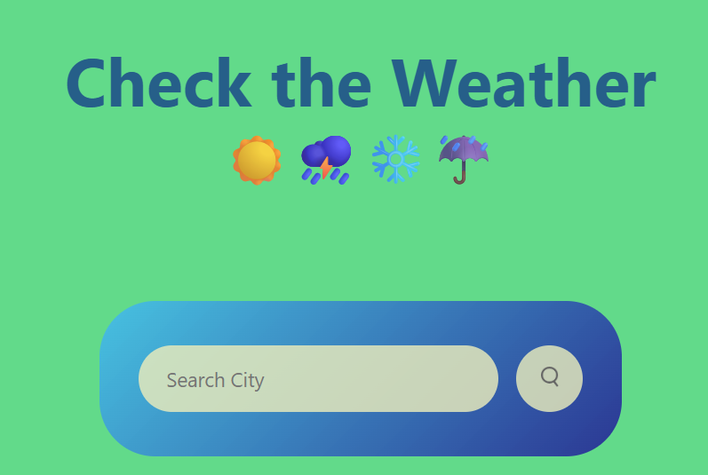
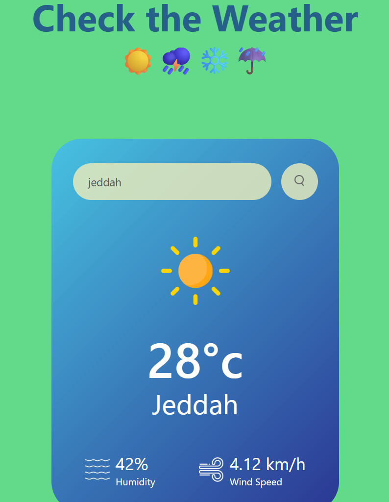

# Weather App
A simple and responsive weather application that allows users to search for real‑time weather information for any city.
The app fetches live weather data using a public API and displays temperature, conditions, humidity, and more.

Frontend Repo: https://github.com/STEM-Girlie/Weather-App

## Table of Contents
- [Overview](#overview)
- [Features](#features)
- [Tech Stack](#tech-stack)
- [Architecture](#architecture)
- [Database Design](#database-design)
- [API Endpoints](#api-endpoints)
- [Installation](#installation)
- [Environment Variables](#environment-variables)
- [Usage](#usage)
- [Screenshots](#screenshots)
- [Deployment](#deployment)
- [Future Improvements](#future-improvements)
- [Credits](#credits)
- [License](#license)


## Overview
### Motivation
I built this project to practise working with APIs, improve my JavaScript skills, and create a clean, user‑friendly interface for retrieving real‑time weather data.

### Objective
To provide users with a simple tool to check the weather in any city, while demonstrating my ability to work with external APIs, DOM manipulation, and responsive UI design.

### Learning Outcomes
- Worked with a public weather API
- Implemented dynamic DOM updates
- Improved JavaScript fundamentals
- Practised responsive layout design
- Deployed a frontend project

## Features
- Search weather by city name
- Displays temperature, humidity, wind speed, and weather conditions
- Responsive UI
- Error handling for invalid city names
- Clean and simple design

## Tech Stack
### Frontend
- HTML5
- CSS3
- JavaScript
- Fetch API

### Tools
- Git & GitHub
- VS Code
- GitHub Pages (for deployment)

## Architecture
Client‑side only application:
User Input → Fetch API → Weather API → Display Results in UI

## Folder Structure
```
Weather-App/
 ├── index.html
 ├── styles.css
 ├── Weather App.html
 ├── images/
 ├── Weather App_files/
 └── README.md
```

## Database Design
This project does not use a database.
All data is fetched live from a weather API.

## API Endpoints
Example (OpenWeatherMap API):
GET https://api.openweathermap.org/data/2.5/weather?q={city}&appid={API_KEY}&units=metric

## Installation
### Clone the Repository
```
git clone https://github.com/STEM-Girlie/Weather-App.git
cd Weather-App
```

No dependencies are required — this is a pure HTML/CSS/JS project.

## Environment Variables
If using OpenWeatherMap or another API, create an API key:
API_KEY=your_api_key_here

Then insert it into your JavaScript file where required.

## Usage
- Open the app in your browser
- Enter a city name
- View real‑time weather information
- Search again for another location

## Screenshots




## Deployment
- You can deploy this project using GitHub Pages:
- Go to your repo settings
- Scroll to “Pages”
- Select the main branch
- Save
- Your live link will appear

## Future Improvements
- Add 5‑day forecast
- Add geolocation (detect user’s current city)
- Add dark mode
- Improve UI animations
- Add loading states

## Credits
Developer: Nasreen Baker  
GitHub: https://github.com/STEM-Girlie

## License
This project is licensed under the MIT License.
